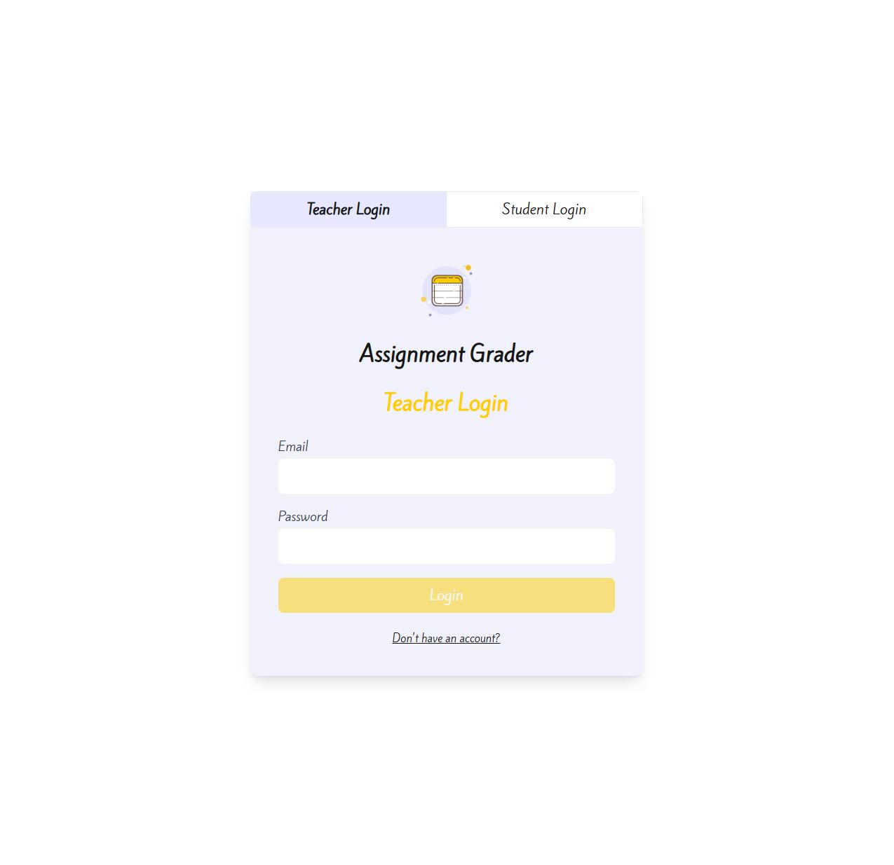

# Assignment Grader

## Overview

**Assignment Grader** is a web-based system that allows **teachers** to create assignments, track student submissions, and grade assignments efficiently. **Students** can submit their work via Google Drive or PDF links and view their grades once assigned.

---

## Tech Stack

- **Frontend**: Angular 19, TailwindCSS v4
- **Backend**: C# ASP.NET Core
- **Database**: SQL Server
- **Authentication**: JWT-based authentication

---

## Features

### **For Students**

- View assignments with due dates.
- Submit assignment links (Google Drive/PDF).
- View grades once evaluated.

### **For Teachers**

- Create new assignments with instructions.
- View all student submissions.
- Grade submitted assignments.
- Manage enrolled students.

---

## Installation

### **Frontend Setup**

```sh
cd frontend
npm install
ng serve
```

Application will run on `http://localhost:4200`

### **Backend Setup**

```sh
cd backend
# Restore dependencies
dotnet restore
# Run the project
dotnet run
```

Backend runs on `http://localhost:5000`

---

## Screenshots

### **Authentication**

| Login                                           | Registration                                                  |
| ----------------------------------------------- | ------------------------------------------------------------- |
|  |  |

### **Student Dashboard (Full Width)**


### **Student Individual Assignments**

| Unsubmitted                                                                                                 | Submitted                                                                                   | Graded                                                                                            |
| ----------------------------------------------------------------------------------------------------------- | ------------------------------------------------------------------------------------------- | ------------------------------------------------------------------------------------------------- |
|  |  |  |

### **Teacher Dashboard (Full Width)**


### **Teacher Individual Assignments**

| View Assignment                                                                             | Grade Assignment                                                                                  |
| ------------------------------------------------------------------------------------------- | ------------------------------------------------------------------------------------------------- |
|  |  |

---

## Diagrams

### **Class Diagram**


### **System Architecture Diagram**


### **API Flow Diagram**


---

## API Endpoints

### **Authentication**

- `POST /api/auth/register/{userType}` - Register a new user (Student/Teacher).
- `POST /api/auth/login/{userType}` - Login as a student or teacher.

### **User Management**

- `GET /api/users/students` - Get a list of all students (Teacher access only).

### **Assignments**

- `GET /api/assignments` - Fetch assignments created by the teacher.
- `POST /api/assignments/create` - Create a new assignment.
- `PATCH /api/assignments/{assignmentId}/edit` - Edit an existing assignment.
- `DELETE /api/assignments/{assignmentId}` - Delete an assignment.
- `PATCH /api/assignments/{assignmentId}/add-students` - Add students to an assignment.
- `PATCH /api/assignments/{assignmentId}/remove-student/{studentId}` - Remove a student from an assignment.
- `GET /api/assignments/{assignmentId}` - Fetch individual assignment details (Teacher view).
- `GET /api/assignments/{assignmentId}/student-view` - Fetch individual assignment details (Student view).
- `GET /api/assignments/student-assignments` - Get assignments assigned to a student.

### **Submissions**

- `POST /api/submissions/submit` - Submit an assignment (Student access only).
- `GET /api/submissions/my-submissions` - Get all submissions by a student.
- `GET /api/submissions/{assignmentId}/my-submission` - Get a student's submission for a specific assignment.
- `DELETE /api/submissions/{submissionId}/delete` - Delete a student's submission (if ungraded).
- `GET /api/submissions/{assignmentId}` - Get all submissions for an assignment (Teacher access only).
- `PATCH /api/submissions/{submissionId}/grade` - Grade a student's submission.

---

## License

This project is licensed under the MIT License.

---

## Contact

For any issues or feature requests, feel free to reach out.
